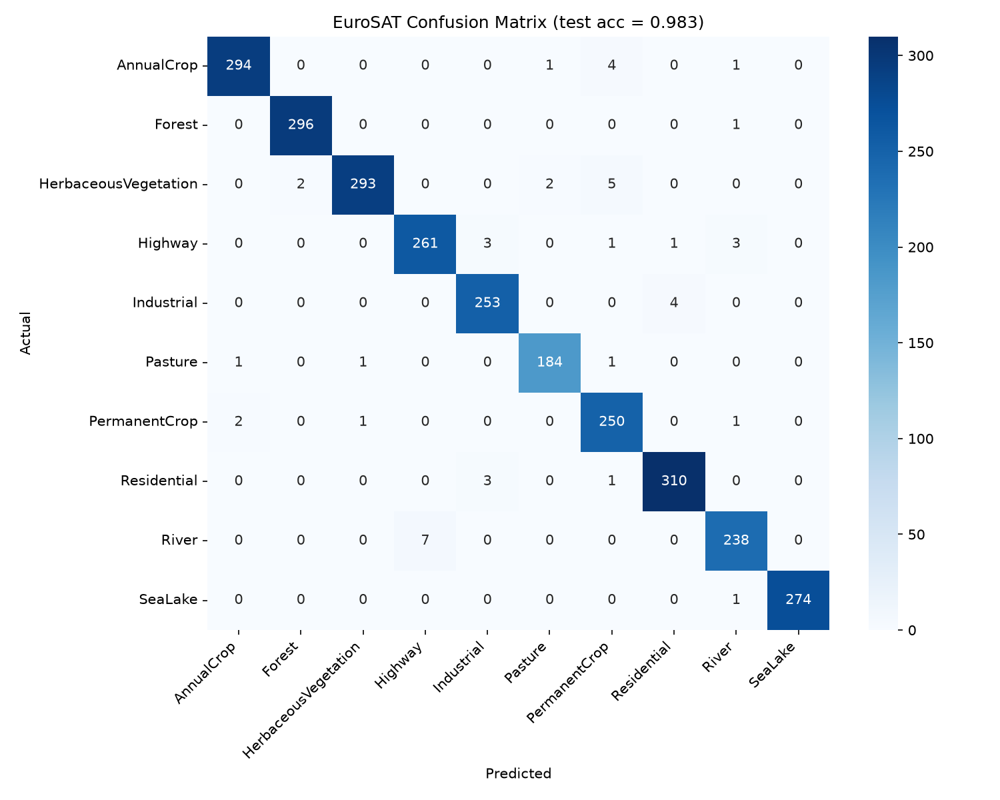
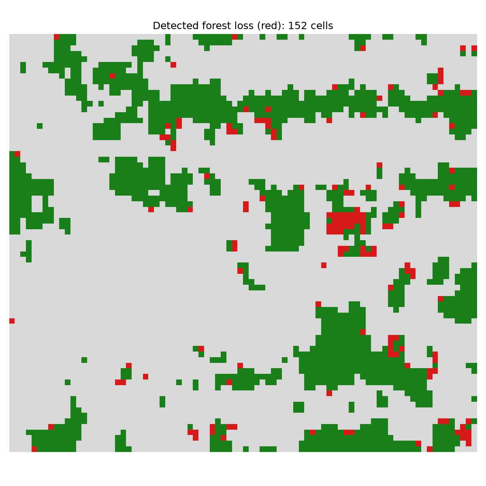
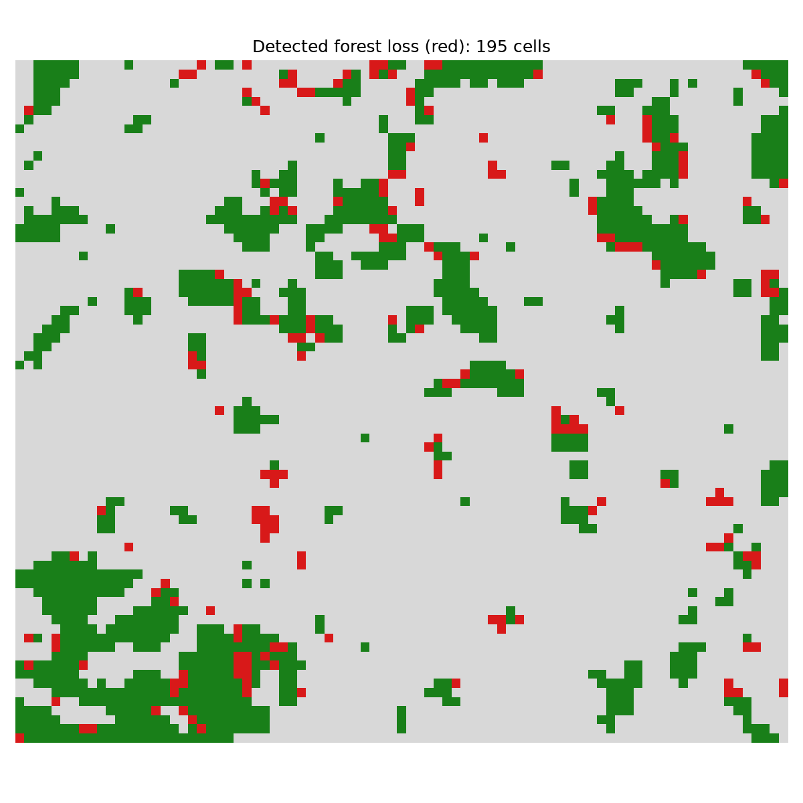

# Satellite Land-Cover Classifier & Deforestation Detector

A lightweight, reproducible pipeline that fine-tunes **ResNet50** (ImageNet) on the
**EuroSAT** Sentinel-2 dataset, then applies the classifier to two-date Sentinel-2
imagery to **detect deforestation**, validated against **Global Forest Watch** —
demonstrated on **two** Amazon frontiers.

Trains locally on a single consumer GPU in ~20 minutes. No Google Colab required.


## Results at a glance

**Land-cover classifier:** 98.26% test accuracy (2,700 held-out images), macro-F1 0.982,
all per-class F1 ≥ 0.97, Forest recall 0.997.



**Deforestation detection vs Global Forest Watch** (Hansen GFC-2024, 2016→2024, finer grid):

| Study area | Loss cells | Precision (any-loss) | F1 (≥50% cell) |
|---|---|---|---|
| Rondônia (fishbone frontier) | 152 | 0.82 | 0.25 |
| São Félix do Xingu (cattle frontier) | 195 | **0.99** | **0.29** |

The European-trained model generalizes to two distinct tropical frontiers, performing
better on São Félix's larger, cleaner clearings. Detected forest loss (red) clusters at
forest edges adjacent to cleared land:

Rondônia | São Félix do Xingu
:---:|:---:
 | 

## Key finding: radiometric domain shift

A 98%-accurate classifier produced **garbage** on real imagery — 72% of a rainforest scene
labeled "water" — because EuroSAT's training images are radiometrically different (hazier,
blue-cast) from modern atmospherically-corrected Sentinel-2 L2A. Per-channel **moment
matching** (rescaling each scene's channel mean/std to EuroSAT's) fixes it. This is the
single most important step for valid results and a concrete demonstration that benchmark
accuracy does not transfer for free.

## What's corrected vs. typical EuroSAT tutorials

| Common tutorial issue | Fix here |
|---|---|
| `ImageFolder(transform=...)` then `random_split` leaks augmentation into val/test | Per-split transforms (`src/data.py`) |
| Deprecated `resnet50(pretrained=True)` | `weights=ResNet50_Weights.DEFAULT` |
| No fixed seed (irreproducible) | `set_seed()` + seeded split (seed 42) |
| Early stopping described but best model never saved | Best-checkpoint-by-val-accuracy |
| Retired `scihub.copernicus.eu` for imagery | Copernicus **Data Space** (openEO) |
| Naive Sentinel-2 render → forest misclassified as water | Radiometric **moment matching** |

## Repository layout

```
config.py              Central paths + hyper-parameters + class names
download_data.py       Fetch + arrange EuroSAT (~90 MB)
src/
  data.py              Seeded split + per-split transforms
  model.py             ResNet50 transfer-learning model
  train.py             Two-phase training (freeze head -> fine-tune)
  evaluate.py          Test metrics + confusion matrix
  utils.py             Seeding / device helpers
deforestation/
  download_sentinel.py Two-date Sentinel-2 via Copernicus Data Space (openEO)
  patchify.py          Georeferenced 64x64 tiling + EuroSAT moment-matching
  classify_patches.py  Per-patch classification -> land-cover grid
  change_detection.py  Forest -> non-Forest change map + event list
  validate_gfw.py      Validate vs Hansen Global Forest Change
paper/
  paper.md             Full research-paper draft
  results_summary.md   All numerical results
  figures/             Confusion matrix + change maps
```

## Setup

```powershell
python -m venv .venv ; .\.venv\Scripts\Activate.ps1
# CUDA build matching the GPU driver (CUDA <= 12.7 -> cu126):
pip install torch torchvision --index-url https://download.pytorch.org/whl/cu126
pip install scikit-learn matplotlib seaborn numpy pandas tqdm rasterio openeo
```

## Run

```powershell
python download_data.py          # one-time EuroSAT download
python -m src.train              # two-phase training -> best checkpoint
python -m src.evaluate           # test metrics + confusion_matrix.png

# Deforestation (needs a free Copernicus Data Space account):
python deforestation/download_sentinel.py                       # interactive login
python deforestation/patchify.py <scene_A.tif> patches_A.npz --stride 32
python deforestation/classify_patches.py patches_A.npz grid_A.npz
# ...repeat for scene B, then:
python deforestation/change_detection.py grid_A.npz grid_B.npz out/change
python -m deforestation.validate_gfw out/change_mask.npz --year-a 2016 --year-b 2024
```

## Limitations

European training imagery applied to tropical Brazil (domain shift, partly mitigated by
moment matching); 640 m patches miss small/linear clearings (caps recall); RGB-only drops
informative spectral bands; cloud/seasonal phenology can cause false change. See
`paper/paper.md` §4 for full discussion.

## Citation / data sources

- EuroSAT: Helber et al., *IEEE JSTARS*, 2019.
- Forest-loss reference: Hansen et al., *Science*, 2013 (Global Forest Watch).
- Imagery: Copernicus Sentinel-2 (ESA), via the Copernicus Data Space Ecosystem.

## License

MIT (see `LICENSE`).
