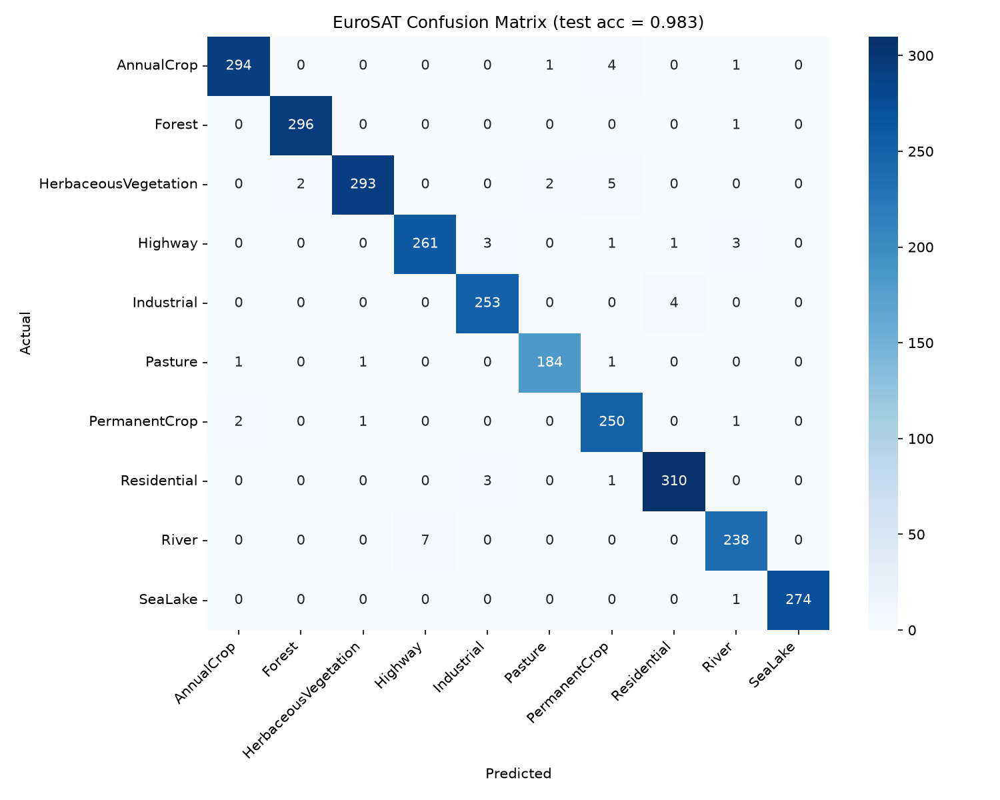
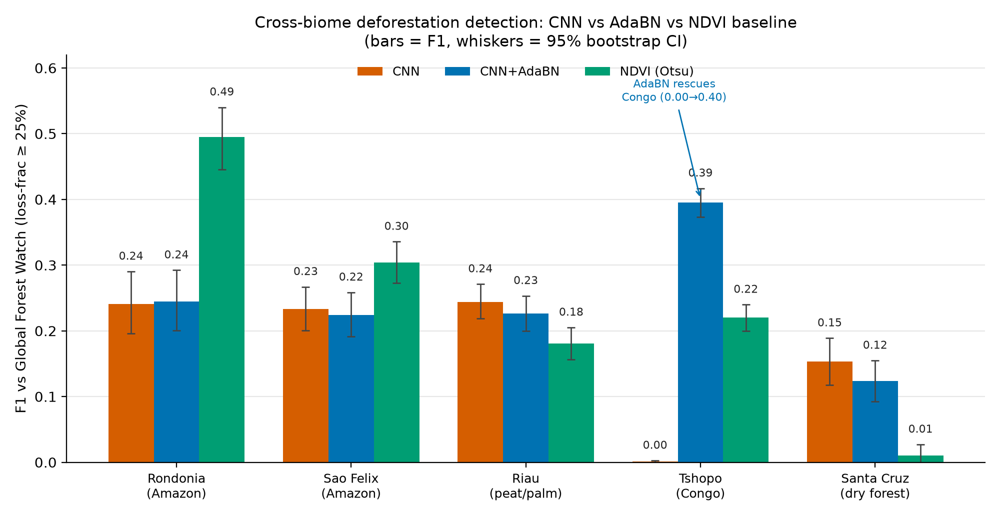

# Satellite Land-Cover Classifier & Deforestation Detector

A lightweight, reproducible pipeline that fine-tunes **ResNet50** (ImageNet) on the
**EuroSAT** Sentinel-2 dataset, then applies the classifier to two-date Sentinel-2
imagery to **detect deforestation**, validated against **Global Forest Watch** across
**eight frontiers in three biomes** — with a **label-free domain adaptation (AdaBN)** and
a classical **NDVI baseline** for a fair, rigorous comparison.

Trains locally on a single consumer GPU in ~20 minutes. No Google Colab required.

> **TL;DR of the science:** benchmark accuracy (98%) does not transfer for free. The
> classifier collapses out of biome (Congo Basin, F1 0.001), a domain-shift failure on a
> composite our diagnostics show to be clean, and a label-free **AdaBN** pass rescues it
> (F1 0.001 to 0.397). Across biomes, robustness beats peak in-biome F1.


## Results at a glance

**Land-cover classifier:** 98.26% test accuracy (2,700 held-out images), macro-F1 0.982,
all per-class F1 ≥ 0.97, Forest recall 0.997.



**RGB vs 13-band multispectral:** a multispectral ResNet50 scores **98.22%** — no gain over
RGB. The extra spectral bands don't help; RGB already saturates EuroSAT (justifying the
RGB-only deforestation pipeline).

**Cross-biome deforestation detection vs Global Forest Watch** (Hansen GFC-2024, 2016 to 2024,
finer grid). Three detectors go head to head: CNN, CNN+AdaBN (domain-adapted), and an NDVI
baseline, across **8 frontiers / 3 biomes**, each carrying a 95% block-bootstrap CI (F1 at
GFW loss-frac ≥ 25%):

| Site | Biome | CNN | CNN+AdaBN | NDVI |
|---|---|---|---|---|
| Rondônia | Amazon | 0.234 | 0.242 | **0.495** |
| São Félix do Xingu | Amazon | 0.232 | 0.229 | **0.304** |
| Mato Grosso | Amazon | 0.479 | 0.486 | **0.711** |
| Riau, Sumatra | Peat / palm oil | **0.248** | 0.222 | 0.177 |
| Tshopo | Congo Basin | 0.001 | **0.397** | 0.220 |
| Mai-Ndombe | Congo Basin | 0.000 | 0.198 | **0.384** |
| Santa Cruz | Dry forest | **0.156** | 0.126 | 0.010 |
| Gran Chaco | Dry forest | 0.000 | 0.100 | **0.392** |
| **mean ± sd** | | 0.169 ± 0.168 | 0.250 ± 0.130 | **0.337 ± 0.213** |



No method dominates across biomes, and each one fails somewhere for a reason we can name. The
plain CNN is bimodal: it collapses at 3 of 8 sites (both Congo sites and Gran Chaco return zero
or all-wrong detections, a reproducible domain shift) yet scores its best in-domain at Mato
Grosso (0.479). AdaBN clears every collapse without labels and gives the steadiest detector
(lowest spread). NDVI takes the highest mean F1 and still breaks on its own, winning Gran Chaco
dry forest and collapsing at Santa Cruz. Across sites the plain CNN trails NDVI at the edge of
significance (Wilcoxon p=0.055); no other pair separates.

Cells overlap by half (64 px patches on a 32 px stride), so the intervals resample 2×2 cell
blocks rather than individual cells. A naive i.i.d. cell bootstrap reports intervals about
1.9× too narrow.

## Key finding: radiometric domain shift

A 98%-accurate classifier produced **garbage** on real imagery — 72% of a rainforest scene
labeled "water" — because EuroSAT's training images are radiometrically different (hazier,
blue-cast) from modern atmospherically-corrected Sentinel-2 L2A. Per-channel **moment
matching** (rescaling each scene's channel mean/std to EuroSAT's) fixes it. This is the
single most important step for valid results and a concrete demonstration that benchmark
accuracy does not transfer for free.

## What's corrected vs. typical EuroSAT tutorials

| Common tutorial issue | Fix here |
|---|---|
| `ImageFolder(transform=...)` then `random_split` leaks augmentation into val/test | Per-split transforms (`src/data.py`) |
| Deprecated `resnet50(pretrained=True)` | `weights=ResNet50_Weights.DEFAULT` |
| No fixed seed (irreproducible) | `set_seed()` + seeded split (seed 42) |
| Early stopping described but best model never saved | Best-checkpoint-by-val-accuracy |
| Retired `scihub.copernicus.eu` for imagery | Copernicus **Data Space** (openEO) |
| Naive Sentinel-2 render → forest misclassified as water | Radiometric **moment matching** |

## Repository layout

```
config.py              Central paths + hyper-parameters + class names
download_data.py       Fetch + arrange EuroSAT (~90 MB)
src/
  data.py / data_ms.py     Seeded split + per-split transforms (RGB / 13-band)
  model.py / model_ms.py   ResNet50 transfer model (RGB / multispectral conv1 inflation)
  train.py / train_ms.py   Two-phase training (freeze head -> fine-tune)
  evaluate.py / evaluate_ms.py  Test metrics + confusion matrix
  utils.py                 Seeding / device helpers
deforestation/
  sites.py             Registry of 5 study areas (bbox + Hansen GFC tile + biome)
  download_sentinel.py Single two-date Sentinel-2 grab via Copernicus (openEO)
  download_sites.py    Batch RGB+NIR composite download for all sites
  diagnose_composites.py  Per-scene data-quality diagnostics (cloud/nodata/NDVI)
  patchify.py          Georeferenced 64x64 tiling + EuroSAT moment-matching
  classify_patches.py  Per-patch classification -> grid (--adabn domain adaptation)
  change_detection.py  Forest -> non-Forest change map + event list
  ndvi_baseline.py     NDVI-difference baseline (per-scene Otsu threshold)
  validate_gfw.py      Validate vs Hansen Global Forest Change
  run_all_sites.py     Full multi-site eval: CNN/AdaBN/NDVI + block-bootstrap CIs + Wilcoxon
                       (--rescore reuses existing masks, re-scores only)
  plot_multisite.py    Cross-biome comparison figure
experiments/
  da_ablation.py       Controlled domain-adaptation ablation (moment/hist/AdaBN)
paper/
  paper.md / paper.tex Full research-paper draft (Markdown + IEEE LaTeX)
  results_summary.md   All numerical results (6 parts)
  figures/             Confusion matrices + change maps + cross-biome comparison
```

## Setup

```powershell
python -m venv .venv ; .\.venv\Scripts\Activate.ps1
# CUDA build matching the GPU driver (CUDA <= 12.7 -> cu126):
pip install torch torchvision --index-url https://download.pytorch.org/whl/cu126
pip install scikit-learn matplotlib seaborn numpy pandas tqdm rasterio openeo
```

## Run

```powershell
python download_data.py          # one-time EuroSAT download
python -m src.train              # two-phase training -> best checkpoint
python -m src.evaluate           # test metrics + confusion_matrix.png

python -m src.train_ms          # optional: 13-band multispectral variant
python -m src.evaluate_ms        # multispectral test metrics

# Deforestation (needs a free Copernicus Data Space account):
python -m deforestation.download_sites          # batch download all 5 sites (RGB+NIR)
python -m deforestation.diagnose_composites     # data-quality check
python -m deforestation.run_all_sites           # full CNN/AdaBN/NDVI eval + stats + CIs
python -m deforestation.plot_multisite          # cross-biome comparison figure

# ...or a single scene, step by step:
python deforestation/patchify.py <scene_A.tif> patches_A.npz --stride 32
python deforestation/classify_patches.py patches_A.npz grid_A.npz --adabn
python deforestation/change_detection.py grid_A.npz grid_B.npz out/change
python -m deforestation.validate_gfw out/change_mask.npz --year-a 2016 --year-b 2024
```

## Limitations

European training imagery applied to the tropics (domain shift — severe out-of-biome, e.g.
Congo Basin; mitigated by moment matching + AdaBN); n=8 sites limits across-site statistical
power; 640 m patches miss small/linear clearings (caps recall); the NDVI baseline uses an
absolute-drop rule (unfair in dry forest); AdaBN adapts only BatchNorm statistics. See
`paper/paper.md` §4 for full discussion.

## Citation / data sources

- EuroSAT: Helber et al., *IEEE JSTARS*, 2019.
- Forest-loss reference: Hansen et al., *Science*, 2013 (Global Forest Watch).
- Imagery: Copernicus Sentinel-2 (ESA), via the Copernicus Data Space Ecosystem.

## License

MIT (see `LICENSE`).
